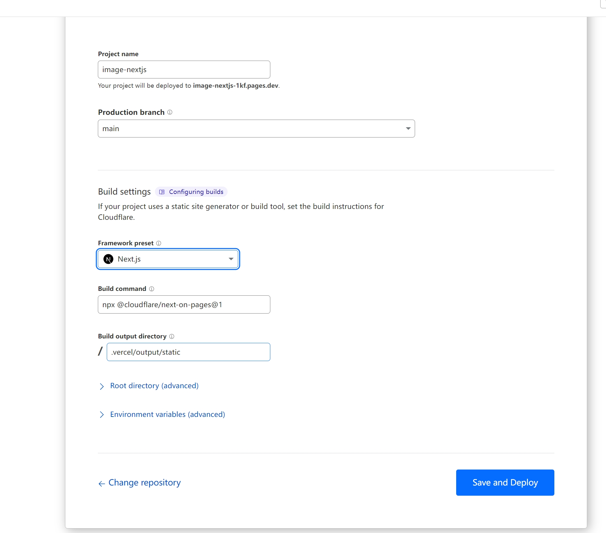
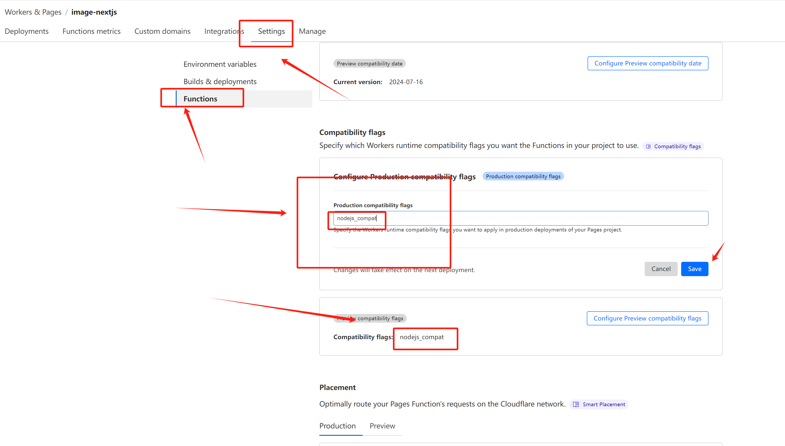
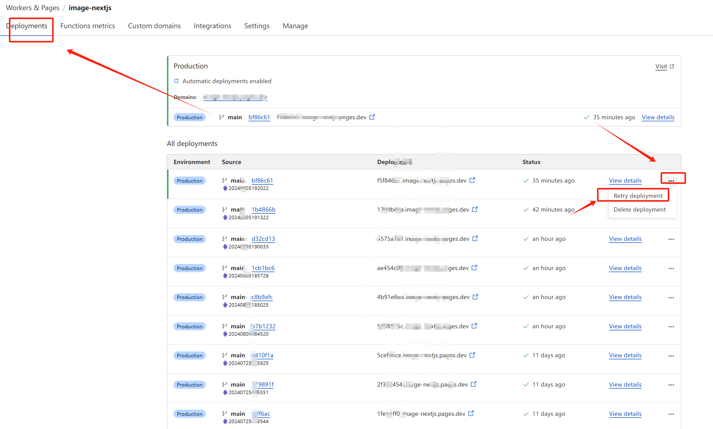

# telegraph-Image

### Demo
[https://img.131213.xyz](https://img.131213.xyz/)

### 测试
[https://testimg.131213.xyz/](https://testimg.131213.xyz/)
> 测试账号：admin

> 测试密码：admin

### 开发计划
- [x] 后台管理
- [x] 鉴黄
- [ ] 画廊
- [ ] referer、IP黑名单

### 优点

1. 无限图片储存数量，你可以上传不限数量的图片

2. 无需购买服务器，托管于Cloudflare的网络上，当使用量不超过Cloudflare的免费额度时，完全免费

3. 无需购买域名，可以使用Cloudflare Pages提供的*.pages.dev的免费二级域名，同时也支持绑定自定义域名

4. 支持图片审查API，可根据需要开启，开启后不良图片将自动屏蔽，不再加载

5. 支持后台图片管理，日志管理，查看访问前20的Referer、IP、img,可以对上传的图片进行在线预览，添加白名单，黑名单等操作

### 利用Cloudflare pages部署

1. 点击[Use this template](https://github.com/x-dr/telegraph-Image/generate)按钮创建一个新的代码库。

2. 登录到[Cloudflare](https://dash.cloudflare.com/)控制台.
3. 在帐户主页中，选择`pages`> ` Create a project` > `Connect to Git`

4. 选择你创建的项目存储库，在`Set up builds and deployments`部分中，`Framework preset(框架)`选`Next.js`即可。

5. 点击`Save and Deploy`部署 。

6. [设置环境变量&开启图片管理功能](./docs/manage.md)

7. 设置兼容性标志，前往后台依次点击`设置`->`函数`->`兼容性标志`->`配置生产兼容性标志` 填写 `nodejs_compat`

8. 前往后台点击`部署` 找到最新的一次部署点`重试部署`。

### Star History

