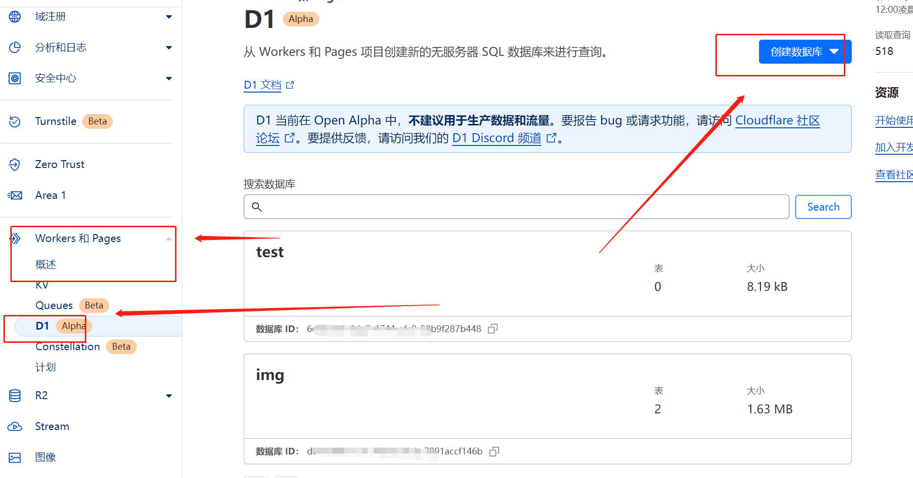
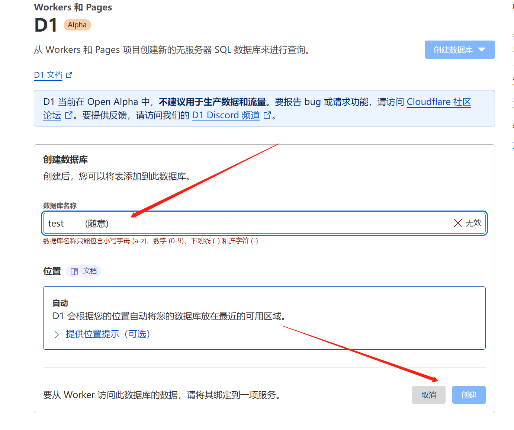
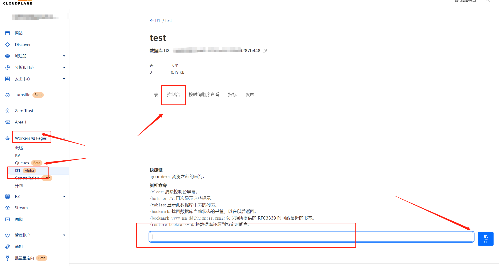
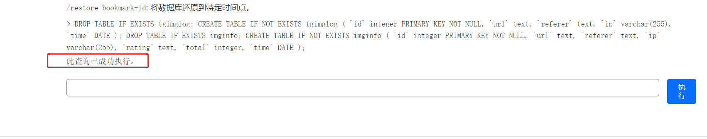
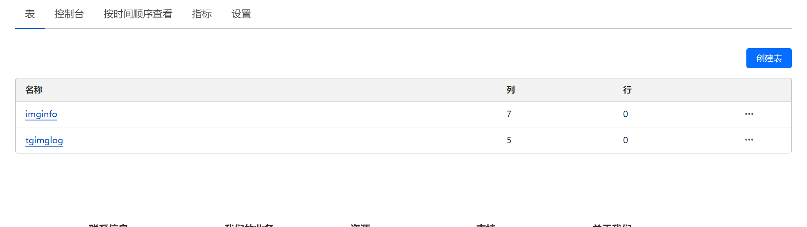
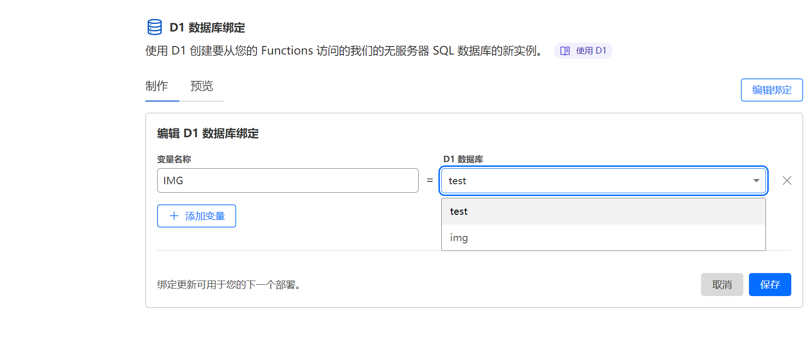
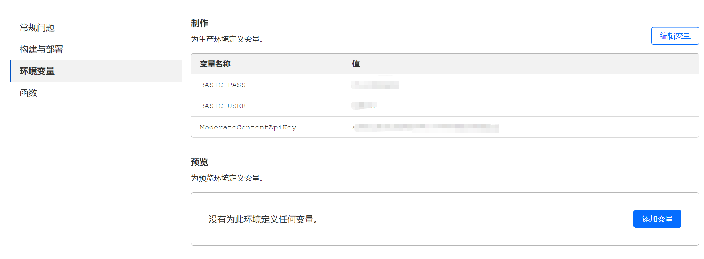
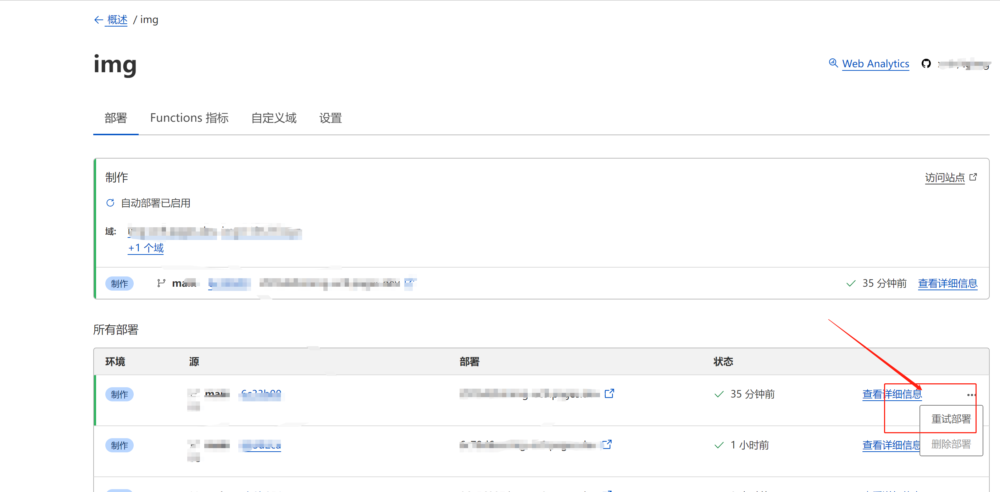

#### 后台管理不是很完善 但基本的应该都有了

1. 创建D1数据库 如图




2. 执行sql命令创建表（在控制台输入框粘贴下面语句执行即可）
```sql
DROP TABLE IF EXISTS tgimglog;
CREATE TABLE IF NOT EXISTS tgimglog (
	`id` integer PRIMARY KEY NOT NULL,
    `url` text,
    `referer` text,
	`ip` varchar(255),
	`time` DATE
);
DROP TABLE IF EXISTS imginfo;
CREATE TABLE IF NOT EXISTS imginfo (
	`id` integer PRIMARY KEY NOT NULL,
    `url` text,
    `referer` text,
	`ip` varchar(255),
	`rating` text,
	`total` integer,
	`time` DATE
);
```





3. 选择部署完成`telegraph-Image`项目，前往后台依次点击`设置`->`函数`->`D1 数据库绑定`->`编辑绑定`->`变量名称填写`：`IMG` 命名空间 选择你提前创建好的D1 数据库绑定



4. 后台管理页面新增登录验证功能，默认也是关闭的，如需开启请部署完成后前往后台依次点击`设置`->`环境变量`->`为生产环境定义变量`->`编辑变量` 添加如下表格所示的变量即可开启登录验证

*[鉴黄api部署](https://github.com/x-dr/nsfwjs-api)*

> `ModerateContentApiKey` 请前往 [https://moderatecontent.com/] (https://moderatecontent.com/)注册免费获取API key


| 变量名称      | 值 | type |
| ----------- | ----------- | ----------- |
|PROXYALLIMG  | 反向代理所有图片（默认为false）| boolean |
|BASIC_USER   | <后台管理页面登录用户名称>| string |
|BASIC_PASS   | <后台管理页面登录用户密码>| string |
|ENABLE_AUTH_API   | 是否开启tg channel访客验证 （默认为false）| boolean |
|REGULAR_PASS | <普通用户 （tg channel访客验证）>| string |
|REGULAR_PASS   | <普通用户密码>| string |
|ModerateContentApiKey   | <审查图像内容的API key>| string |
|RATINGAPI     | <[自建的鉴黄api](https://github.com/x-dr/nsfwjs-api) >| string |
|CUSTOM_DOMAIN | https://your-custom-domain.com (自定义加速域名) | string |
|TG_BOT_TOKEN  | 123468:AAxxxGKrn5 (从 [@BotFather](https://t.me/BotFather)) |string |
|TG_CHAT_ID   | -1234567 (频道的ID,TG Bot要是该频道或群组的管理员) |string |

> TG_BOT_TOKEN

<a href="https://img.131213.xyz/api/file/02735b83dbdcf5fe31a45.png" target="_blank"></a>

> 获取ID机器人 [@VersaToolsBot](https://t.me/VersaToolsBot)

> `TG_CHAT_ID`为目标对话的唯一标`ID`或目标频道的用户名（eg: @channelusername），当目标对话为个人或私有频道是只能是`ID`,当为公开频道或群组是可以为目标频道的用户名（eg: `@channelusername`）


> 优先级 `RATINGAPI` > `ModerateContentApiKey`

> `RATINGAPI`的格式 `https://xxx.xxx/rating`




5. 返回最新部署完成`telegraph-Image`项目后台点击`重试部署` 使环境变量生效


## 返回最新部署完成`telegraph-Image`项目后台点击`重试部署` 使环境变量生效


